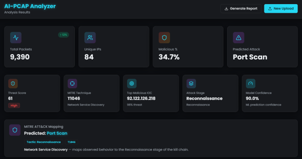
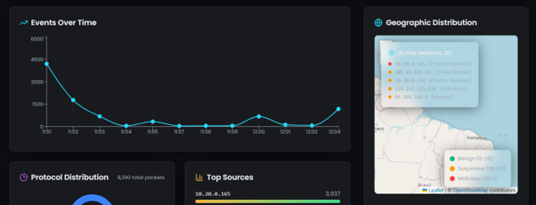
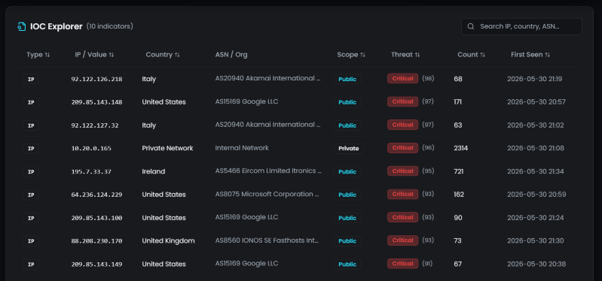

# AI-PCAP Analyzer

## Cyber Threat Intelligence Enhanced Network Traffic Analysis Platform

AI-PCAP Analyzer is a Machine Learning and Cyber Threat Intelligence (CTI) based platform developed to automate network traffic investigation from PCAP files.

The system analyzes packet captures, identifies malicious activities, extracts Indicators of Compromise (IOCs), enriches findings with threat intelligence, maps attacks to the MITRE ATT&CK framework, and generates analyst-ready reports.

---

## Key Features

### Machine Learning Detection
- Automated traffic classification
- Malicious activity detection
- Attack categorization

### Cyber Threat Intelligence
- IOC Extraction
- GeoIP Enrichment
- ASN & Organization Lookup
- MITRE ATT&CK Mapping
- Threat Scoring
- Analyst Recommendations

### Interactive Dashboard
- Traffic Statistics
- Protocol Distribution
- Geographic Threat Visualization
- IOC Explorer
- MITRE ATT&CK Mapping

### Reporting
- Automated PDF Report Generation
- Threat Intelligence Summary
- IOC Analysis
- Analyst Recommendations

---

## System Workflow

```text
PCAP Upload
↓
Packet Parsing
↓
Feature Extraction
↓
Machine Learning Analysis
↓
Attack Detection
↓
IOC Extraction
↓
CTI Enrichment
↓
MITRE ATT&CK Mapping
↓
Threat Scoring
↓
Dashboard Visualization
↓
PDF Report Generation
```

---

## Technology Stack

### Frontend
- React
- TypeScript
- Tailwind CSS
- Recharts
- Leaflet

### Backend
- Node.js
- Express.js

### Machine Learning
- Python
- Scapy
- Scikit-Learn
- Random Forest

### Threat Intelligence
- MITRE ATT&CK
- GeoIP Enrichment
- IOC Analysis
- Threat Scoring

---

# Screenshots

## Landing Page


---

## Analysis Dashboard



---

## Protocol Distribution


---

## Geographic Threat Visualization



---

## IOC Explorer



---

## Generated Threat Intelligence Report


---

## Sample Output

| Metric | Value |
|----------|----------|
| Total Packets | 9,390 |
| Unique IPs | 84 |
| Malicious Traffic | 34.7% |
| Predicted Attack | Port Scan |
| Threat Score | 61 |
| MITRE Technique | T1046 |

---

## Future Enhancements

- VirusTotal Integration
- AbuseIPDB Integration
- OpenCTI Integration
- STIX/TAXII Support
- Real-Time Monitoring
- Automated Threat Attribution

---

## Academic Project

Developed as part of Cyber Threat Intelligence coursework to demonstrate the integration of Machine Learning and Cyber Threat Intelligence techniques for automated network traffic analysis.
